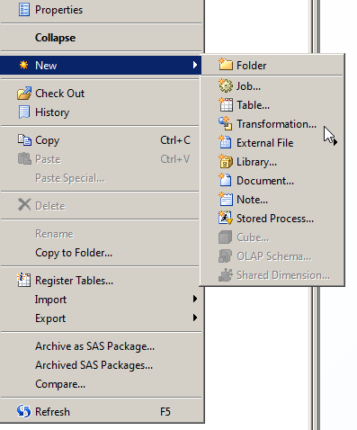
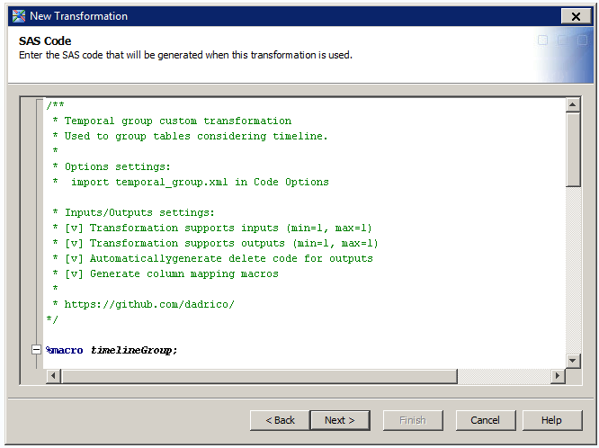
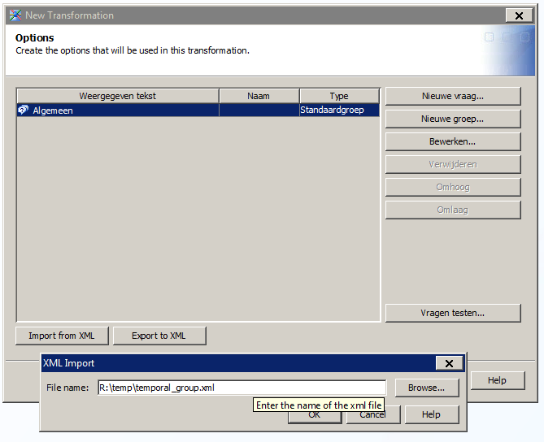
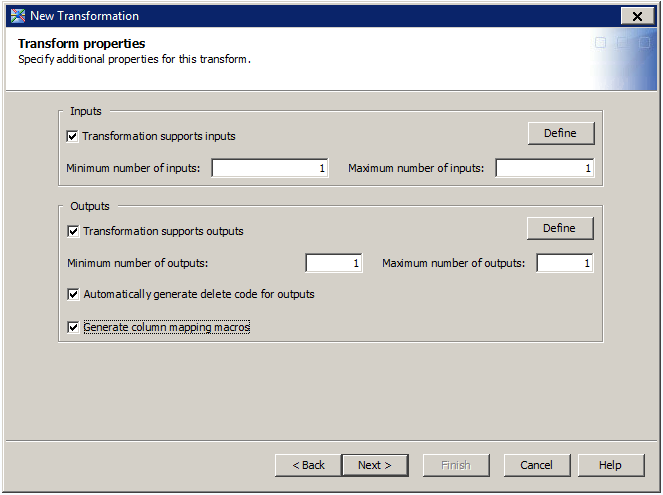

In this section you can find a colleciton of SAS Data Integration Studio transformations that you can use in your projects.

In order to use a trasformation you need to create it in your metadata. To do that:

1. Create a new transformation:
   
   

2. Paste the SAS code from a .sas file to the wizard's SAS Code window:

   

3. Import options from a .xml file in the wizard's Options window:

   

4. Tick the right boxes in the wizard's Transform properties window. The correct options are always given in the comment section of the code in the .sas file:

   > * Inputs/Outputs settings:
   > * [v] Transformation supports inputs (min=1, max=1)
   > * [v] Transformation supports outputs (min=1, max=1)
   > * [v] Automaticallygenerate delete code for outputs
   > * [v] Generate column mapping macros
   
   

5. Complete the wizard and you're ready to go. Enjoy!
